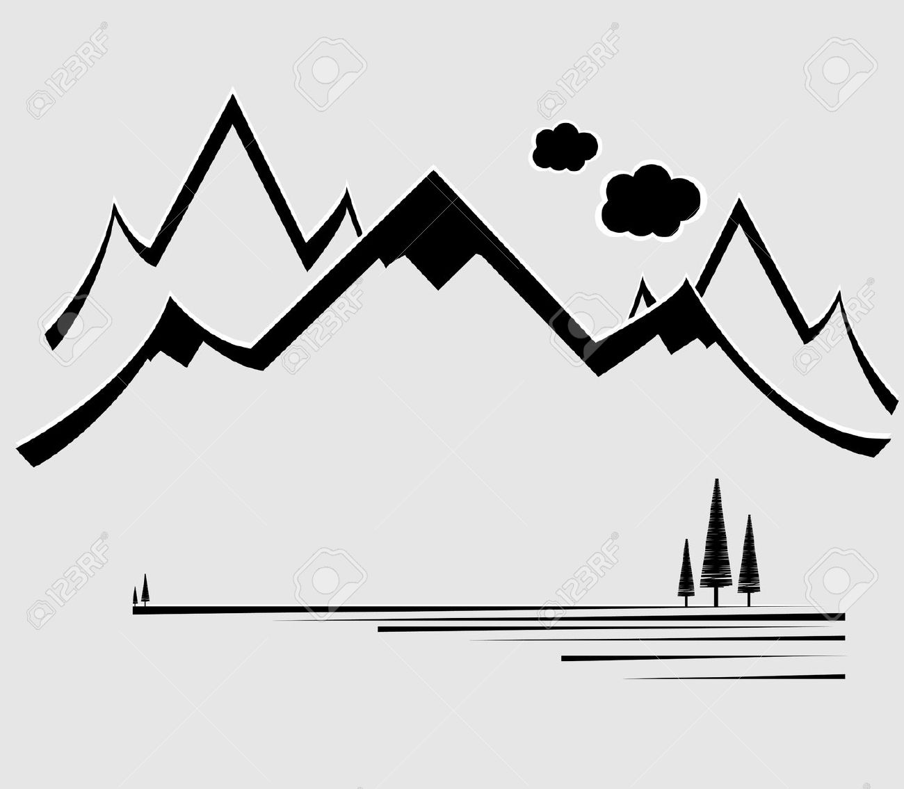
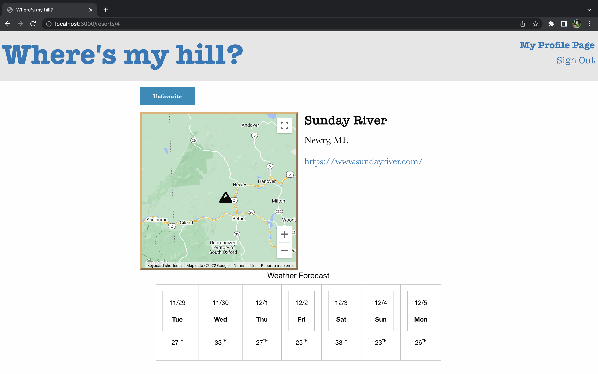
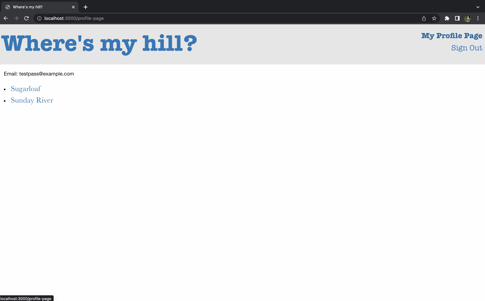

# Where's My Hill?

As a snowboarder or skiier, you tell your friends to "meet you on the hill!". But what hill do we choose? **Where's my hill?**

This is an application to help a user determine their choice of mountain resort. [Here is the deployed website](https://mountaindex.onrender.com/).

## Usage Instructions

An index page shows a list of resorts in New England, and by clicking on a resorts tile a user will be sent to the resorts show page which has details about the resort. A user can also create an account to create a list of their favorite mountains for quick reference which will be shown on a users profile page. On the show page for each of the resorts there will be a button letting a user favorite or unfavorite a particular mountain.

## TODO

* more description for resorts (description, trail count, lift count)
* dynamic size icons for resorts based on trail count
* weekend weather preview on user profile page
* testing

## Contributing

Bug reports and pull requests are welcome on GitHub at [Marko's Breakable Toy GitHub page](https://github.com/user072521/breakable_toy). Use the fork-and-branch workflow to contribute.

This project is intended to be a safe, welcoming space for collaboration, and contributors are expected to adhere to the [Contributor Covenant](https://www.contributor-covenant.org/) code of conduct.

## Configuration Information

* Ruby version 2.7.3
